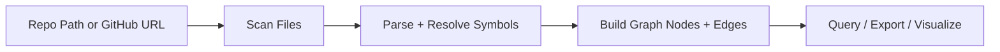
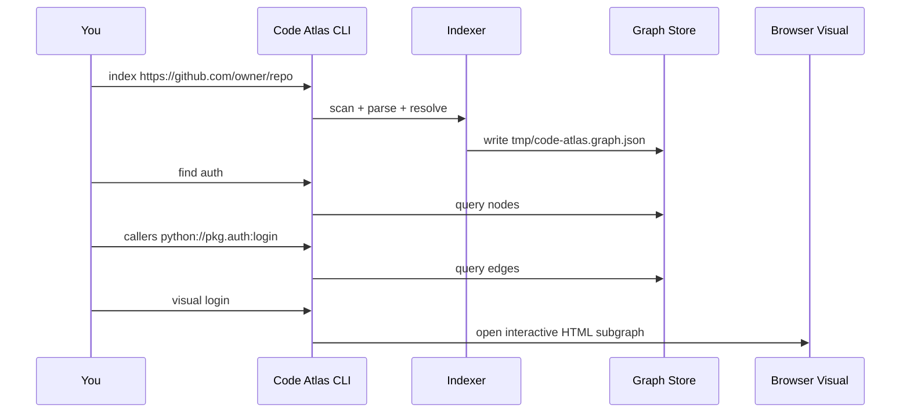
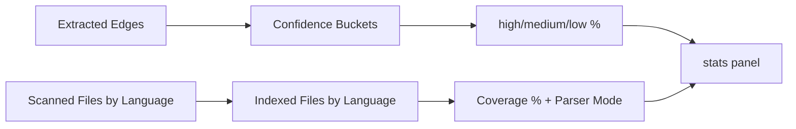
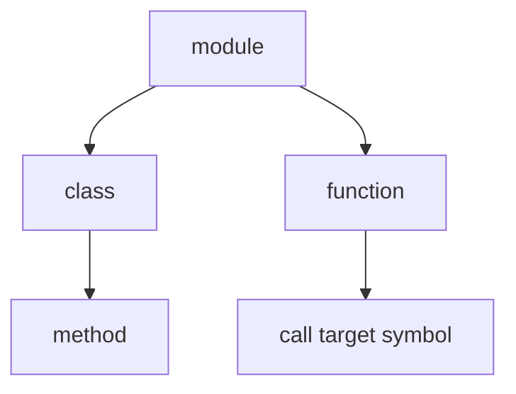
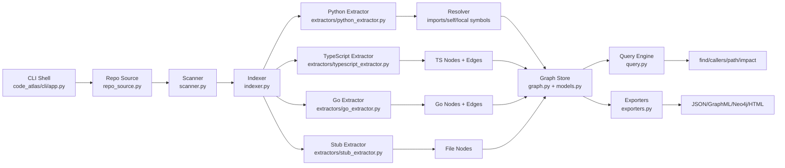
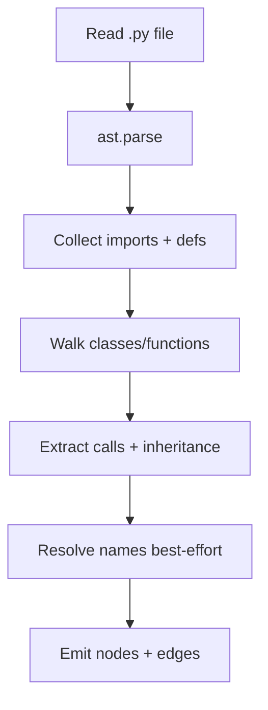
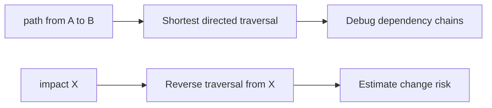
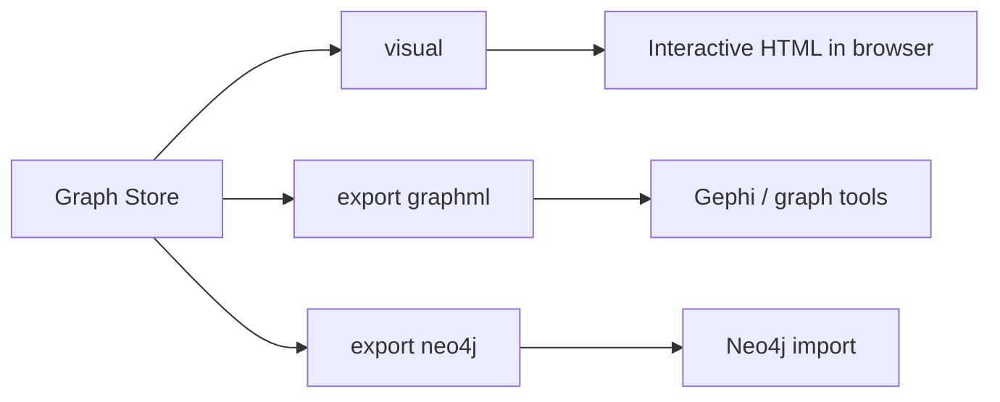
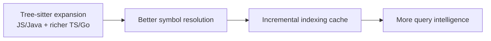

# Code Atlas

Code Atlas turns a repo into a **knowledge graph** so humans and AI agents can explore code structure fast.

Instead of reading files one-by-one, you can ask:

- where a symbol is defined
- who calls it
- how two symbols are connected
- what may break if a symbol changes

---

## 1) One-minute mental model



Think of it as:

- **Scanner** finds code files.
- **Extractors** read syntax and relationships.
- **Graph Store** saves structure.
- **Query Engine** answers navigation/debug questions.

---

## 2) How to run

Install dependencies first:

```bash
uv sync
```

Start the interactive CLI:

```bash
code-atlas
```

or:

```bash
uv run python main.py
```

Default graph file is:

`tmp/code-atlas.graph.json`

---

## 3) Typical workflow



---

## 4) Commands (inside interactive shell)

```text
help
index <repo-or-github-url> [--out PATH]
load [PATH]
stats
find <name> [--limit N]
callers <symbol> [--limit N]
related <file> [--depth N] [--limit N]
path <from> <to> [--max-depth N]
impact <symbol> [--depth N] [--limit N]
export graphml [--out PATH]
export neo4j [--out DIR]
visual <symbol> [--depth N] [--limit N] [--out PATH]
raw on|off
where
clear
exit
```

### Stats quality reporting

`stats` now includes quality and coverage signals:

- confidence distribution (count + %) for edges: `high`, `medium`, `low`
- extraction coverage per language:
  - files seen
  - files indexed
  - coverage percentage
  - parser mode (`ast`, `tree-sitter`, `regex-fallback`, `stub`)



---

## 5) What is a symbol?

A symbol is any named code entity represented in the graph.



Examples:

- `python://code_atlas.query` (module)
- `python://code_atlas.query:find_symbol` (function)
- `python://pkg.mod:Class.method` (method)

Tip: use `find <text>` first to discover valid symbol IDs.

---

## 6) Architecture (simple)



---

## 7) Parser flow (Python today)



Edges currently include:

- `CONTAINS`
- `IMPORTS`
- `CALLS`
- `INHERITS`

Resolution is best-effort (Python is dynamic), so edges carry confidence.

---

## 8) Path + blast radius



- `path` helps explain how two symbols connect.
- `impact` shows likely upstream breakage surface.

---

## 9) Visualization + exports



Default artifact locations (under git-ignored `tmp/`):

- `tmp/code-atlas.graph.json`
- `tmp/graph-view.html`
- `tmp/code-atlas.graphml`
- `tmp/neo4j/nodes.csv`
- `tmp/neo4j/edges.csv`

---

## 10) Example session

```text
index .
stats
find find_symbol
callers python://code_atlas.query:find_symbol
path python://code_atlas.cli:_cmd_interactive python://code_atlas.query:find_symbol
impact python://code_atlas.query:find_symbol --depth 3
visual find_symbol
export graphml --out tmp/repo.graphml
export neo4j --out tmp/neo4j
```

---

## 11) Current limitations

- Deep semantic extraction is strongest for Python right now.
- TypeScript and Go use Tree-sitter parsing when available, with regex fallback when parser dependencies are missing.
- Other languages currently use a fallback file-level extractor.
- Dynamic runtime behavior cannot be perfectly resolved statically.

---

## 12) Roadmap


