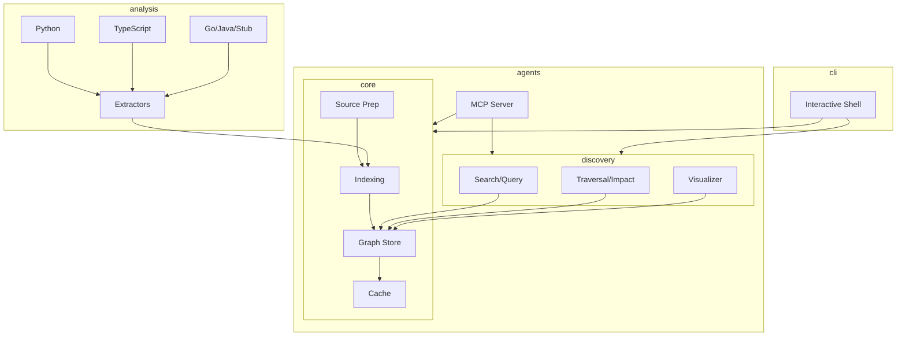

# Code Atlas

Code Atlas is an interactive knowledge graph engine that transforms complex codebases into a queryable, 3D-visualizable map. It is designed to be the **Symbolic Intelligence Layer** for modern AI coding agents.

## Why Code Atlas for AI Agents?

Code Atlas solves the "Context Window" problem for LLMs by providing a structured representation of code that is superior to keyword search:

- **Structural Awareness**: Understands `CALLS`, `INHERITS`, and `IMPORTS` relationships rather than just raw text.
- **Context Efficiency**: Agents can query specific subgraphs, receiving only the architectural context they need, drastically reducing token usage.
- **Blast Radius Analysis**: Built-in `impact` analysis allows agents to calculate the transitive side effects of a proposed change before making it.
- **Native MCP Support**: Built on the **Model Context Protocol**, allowing AI agents to treat the repository graph as an extension of their own memory.

See [docs/agent-lifecycle.md](docs/agent-lifecycle.md) for a step-by-step walkthrough of how an AI agent uses these capabilities.

---

## 1) Core Mission

- **Knowledge Extraction**: Turn local or GitHub repositories into a structured graph of symbols and relationships.
- **Agent Infrastructure**: Expose high-level tools (MCP) for autonomous agents to navigate complex architectures.
- **Fast Navigation**: Answer questions about dependencies, callers, and impact analysis in milliseconds.
- **Modular Architecture**: Built for extensibility across languages and tools.

---

## 2) Architecture

Code Atlas follows a clean, domain-driven modular structure:



- **`code_atlas.core`**: Root indexing orchestration, graph models, and incremental caching.
- **`code_atlas.analysis`**: Language-specific AST and Tree-sitter extractors.
- **`code_atlas.discovery`**: Relationship discovery, search logic, and visualization generation.
- **`code_atlas.agents.mcp`**: Tooling interface for AI agents.
- **`code_atlas.infra`**: Centralized configuration and structured logging.

---

## Setup & Installation

Choose the path that fits your workflow:

### A) The "Power User" Path (Global & Project-Native)
Recommended for using Code Atlas as a permanent tool for your own development projects.

1. **Install Globally**:
   ```bash
   pip install -e .
   ```
2. **Initialize Any Project**:
   ```bash
   cd /path/to/your/project
   code-atlas init
   ```
   *This command indexes your project, creates a local 3D dashboard (`atlas.html`), and generates your MCP config in one step.*

### B) The "Developer" Path (Standalone)
Recommended if you want to contribute to Code Atlas or run it in isolation using `uv`.

1. **Clone & Setup**:
   ```bash
   git clone https://github.com/anismabaziz/code-atlas.git
   cd code-atlas
   uv sync
   ```
2. **Run via uv**:
   ```bash
   uv run code-atlas
   ```

### Running the MCP Server

Expose graph tools to AI agents (e.g., Claude Desktop, Cursor):

```bash
code-atlas-mcp
```

---

## 4) Interactive Commands

| Command          | Description                                           |
| ---------------- | ----------------------------------------------------- |
| `init`           | Zero-config setup for the current project             |
| `index <source>` | Index a local path or GitHub URL                      |
| `stats`          | Show graph statistics and extraction coverage         |
| `find <query>`   | Fuzzy search symbols by name or ID                    |
| `callers <sym>`  | List symbols calling the target                       |
| `path <A> <B>`   | Find shortest directed path between two symbols       |
| `impact <sym>`   | Estimate blast radius of a change                     |
| `visual`         | Generate a hybrid 2D/3D knowledge graph visualization |
| `export`         | Export to GraphML or Neo4j CSV                        |

---

## 5) AI Agent Integration (MCP)

Code Atlas is optimized for agentic workflows. It exposes tools that help agents understand:

1. **Context Discovery**: `find_symbol` and `related_files`.
2. **Behavioral Mapping**: `callers` and `path_between`.
3. **Risk Assessment**: `impact_of_symbol`.

Configure your agent with the `code-atlas-mcp` entry point. Once configured, the AI client (e.g., Claude Desktop) will automatically manage the server lifecycle—starting it in the background when needed and stopping it when the app closes. No manual terminal execution is required.

---

## 6) Development

### Running Tests

```bash
uv run pytest
```

### Testing the MCP Server

You can test the MCP integration without a full IDE using the **MCP Inspector**:

1. **Install the Inspector**: `npm install -g @modelcontextprotocol/inspector`
2. **Run the Server**: `npx @modelcontextprotocol/inspector uv run code-atlas-mcp`
3. **Interact**: Open `http://localhost:5173`, click **Connect**, and use the **Call Tool** tab.

For step-by-step setup (Claude Desktop, Cursor, OpenCode), simply run `code-atlas init` in your project folder.

### Roadmap

- [ ] **Rich Cross-Language Resolution**: Better linking across monorepos.
- [ ] **LLM Integration**: Optional LLM-powered relationship refinement.
- [ ] **Remote Store**: Support for remote graph databases (Neo4j/Memgraph).
- [ ] **Dynamic Language Support**: Plug-and-play extractor modules.

---

_Code Atlas is built for the era of autonomous coding._
