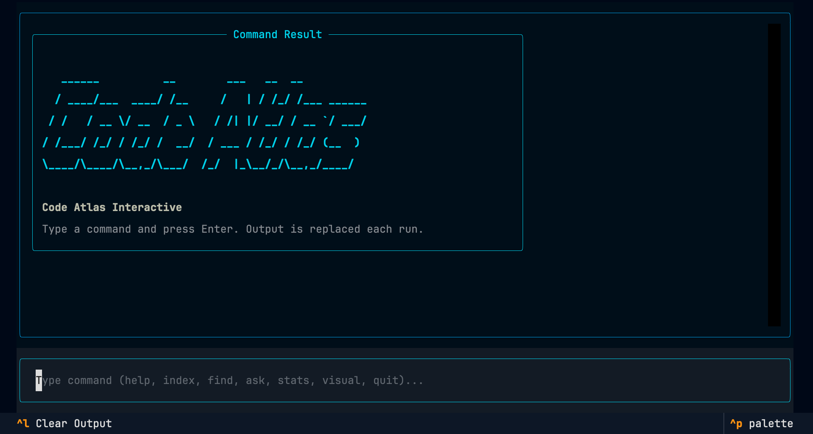
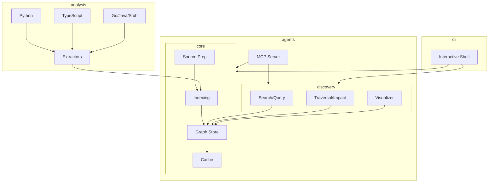

# Code Atlas



Code Atlas is a production-grade repository intelligence system that transforms source code into a queryable knowledge graph. Designed for AI agents and developers, it provides the structural and semantic infrastructure needed to reason about large codebases.

---

## 1) Core Mission

- **Knowledge Extraction**: Turn local or GitHub repositories into a structured graph of symbols and relationships.
- **Agent Infrastructure**: Expose high-level tools (MCP) for autonomous agents to navigate complex architectures.
- **Fast Navigation**: Answer questions about dependencies, callers, and impact analysis in milliseconds.
- **Modular Architecture**: Built for extensibility across languages and tools.

---

## 2) Architecture

Code Atlas follows a clean, domain-driven modular structure:



- **`code_atlas.core`**: Root indexing orchestration, graph models, and incremental caching.
- **`code_atlas.analysis`**: Language-specific AST and Tree-sitter extractors.
- **`code_atlas.discovery`**: Relationship discovery, search logic, and visualization generation.
- **`code_atlas.agents.mcp`**: Tooling interface for AI agents.
- **`code_atlas.infra`**: Centralized configuration and structured logging.

---

## 3) Getting Started

### Installation

```bash
# Clone the repository
git clone https://github.com/anismabaziz/code-atlas
cd code-atlas

# Install dependencies and the package
uv sync
uv pip install -e .
```

### Running the CLI

Start the interactive shell:

```bash
code-atlas
```

### Running the MCP Server

Expose graph tools to AI agents (e.g., Claude Desktop, Cursor):

```bash
code-atlas-mcp
```

---

## 4) Interactive Commands

| Command | Description |
| --- | --- |
| `index <source>` | Index a local path or GitHub URL |
| `stats` | Show graph statistics and extraction coverage |
| `find <query>` | Fuzzy search symbols by name or ID |
| `callers <sym>` | List symbols calling the target |
| `path <A> <B>` | Find shortest directed path between two symbols |
| `impact <sym>` | Estimate blast radius of a change |
| `visual` | Generate an immersive 3D graph visualization (Three.js) |
| `export` | Export to GraphML or Neo4j CSV |

---

## 5) AI Agent Integration (MCP)

Code Atlas is optimized for agentic workflows. It exposes tools that help agents understand:

1. **Context Discovery**: `find_symbol` and `related_files`.
2. **Behavioral Mapping**: `callers` and `path_between`.
3. **Risk Assessment**: `impact_of_symbol`.

Configure your agent with the `code-atlas-mcp` entry point to enable autonomous repository exploration.

---

## 6) Development

### Running Tests

```bash
uv run pytest
```

### Roadmap

- [ ] **Rich Cross-Language Resolution**: Better linking across monorepos.
- [ ] **LLM Integration**: Optional LLM-powered relationship refinement.
- [ ] **Remote Store**: Support for remote graph databases (Neo4j/Memgraph).
- [ ] **Dynamic Language Support**: Plug-and-play extractor modules.

---

*Code Atlas is built for the era of autonomous coding.*
