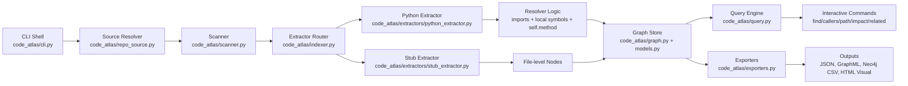

# Code Atlas

`code-atlas` is a polyglot code indexing CLI that turns source code into a normalized knowledge graph for AI agents.

## Why

Agents struggle with large repositories when context is only text chunks. This tool creates a structural graph so agents can ask targeted questions like:

- where a symbol is defined
- what calls a symbol
- which files are structurally related

## Current v1 capabilities

- scans common source file extensions across multiple languages
- builds graph nodes for all supported files
- deep extraction for Python: modules, classes, functions, methods, imports, calls, inheritance
- stub extraction for other languages (file-level nodes) to keep the graph polyglot from day one
- exports graph as JSON
- query commands for symbol lookup, callers, and related files

## Graph schema (v1)

### Node

- `id`: stable identifier (`python://pkg.module:Class.method`)
- `type`: `repo`, `file`, `module`, `class`, `function`, `method`, `symbol`
- `language`: language tag (`python`, `typescript`, `go`, `meta`, ...)
- `name`, `file`, `line`, `column`, `metadata`

### Edge

- `type`: `CONTAINS`, `IMPORTS`, `CALLS`, `INHERITS`
- `source`, `target`
- `language`
- `confidence`: `high` | `medium` | `low`
- `file`, `line`, `column`, `metadata`

## CLI

There is one command to run the tool:

```bash
code-atlas --graph tmp/code-atlas.graph.json
```

Or simply:

```bash
code-atlas
```

When launched, Code Atlas opens an interactive shell with an ASCII logo and a prompt where you execute operations.

Interactive commands:

- `help`
- `index <repo-or-github-url> [--out PATH]`
- `load [PATH]`
- `stats`
- `find <name> [--limit N]`
- `callers <symbol> [--limit N]`
- `related <file> [--depth N] [--limit N]`
- `path <from> <to> [--max-depth N]`
- `impact <symbol> [--depth N] [--limit N]`
- `export graphml [--out PATH]`
- `export neo4j [--out DIR]`
- `visual <symbol> [--depth N] [--limit N] [--out PATH]`
- `where`
- `exit` / `quit`

Default graph output path is `tmp/code-atlas.graph.json`.

Index supports both local paths and GitHub URLs. Examples:

```text
index .
index /absolute/path/to/repo --out my.graph.json
index https://github.com/pallets/flask
index https://github.com/psf/requests.git --out requests.graph.json
```

When a GitHub URL is used, Code Atlas does a shallow clone (`--depth 1`) into a temporary directory, indexes it, writes the graph, then cleans up the temporary clone.

### Graph export and visual exploration

- `export graphml` writes a GraphML file (great for Gephi or other graph tools).
- `export neo4j` writes `nodes.csv` and `edges.csv` for Neo4j bulk import.
- `visual <symbol>` generates and opens a browser-based interactive subgraph around that symbol.

Examples:

```text
export graphml --out tmp/repo.graphml
export neo4j --out tmp/neo4j
visual login --depth 2 --limit 120 --out tmp/login-view.html
```

### Path tracing and blast radius

- `path <from> <to>` finds the shortest directed graph path between two symbols.
- `impact <symbol>` computes reverse-neighborhood impact (what likely breaks if this changes).

Examples:

```text
path python://pkg.auth:login python://pkg.db:execute --max-depth 10
impact python://pkg.auth:login --depth 3 --limit 200
```

## Architecture

- `code_atlas/scanner.py`: language detection and file discovery
- `code_atlas/models.py`: canonical node and edge models
- `code_atlas/graph.py`: in-memory graph store + JSON serialization
- `code_atlas/extractors/python_extractor.py`: Python semantic extraction
- `code_atlas/extractors/stub_extractor.py`: generic fallback extractor
- `code_atlas/indexer.py`: orchestration layer for multi-language indexing
- `code_atlas/query.py`: graph query helpers for agent workflows
- `code_atlas/cli.py`: CLI surface

### Architecture diagram



Pipeline summary:

1. CLI accepts a local path or GitHub URL.
2. Source resolver prepares the repository (local or shallow clone).
3. Scanner discovers source files and detects language.
4. Indexer routes each file to a language extractor.
5. Extractors parse code, resolve symbols, and emit nodes/edges.
6. Graph store persists a normalized knowledge graph.
7. Query engine and exporters power interactive analysis and external integrations.

## How the parser works (detailed)

The parser pipeline is intentionally split into small components so it can scale from Python-only extraction to true polyglot indexing.

### 1) Entry point and command layer

- File: `code_atlas/cli.py`
- Role: launches one interactive shell where all operations are executed (`index`, `load`, `stats`, `find`, `callers`, `related`).
- `index` is the orchestration entry point inside the shell: it resolves local paths or GitHub URLs, calls `build_graph()`, and writes graph JSON.

### 2) Repository scanning and language detection

- File: `code_atlas/scanner.py`
- `scan_source_files(root)` recursively walks the repo and returns source files only.
- It filters common non-source directories (`.git`, `.venv`, `dist`, `build`, `node_modules`, caches).
- `detect_language(path)` maps file extension to a normalized language id (for example `.py -> python`, `.ts -> typescript`).

This stage is language-agnostic and makes the indexer work across mixed-language repos.

### 3) Index orchestration

- File: `code_atlas/indexer.py`
- `build_graph(repo_root)` coordinates scanning and extraction.
- It initializes a shared `GraphStore`, creates a root `repo` node, then routes each file to an extractor by language.
- Current routing:
  - `python -> PythonExtractor` (semantic extraction)
  - all other known languages -> `StubExtractor` (file-level placeholder nodes)

This gives immediate polyglot coverage while allowing deeper per-language extractors to be plugged in over time.

### 4) Graph data model

- Files: `code_atlas/models.py`, `code_atlas/graph.py`
- `Node` and `Edge` are canonical typed records.
- `GraphStore` handles deduplicated node insertion, edge append, stats, and JSON serialization.
- Output format is stable and machine-friendly for AI agents.

The graph has two key design properties:

- Stable IDs (for repeatable references in agent workflows).
- Edge confidence (`high`/`medium`/`low`) so consumers can reason about extraction certainty.

### 5) Python semantic extractor internals

- File: `code_atlas/extractors/python_extractor.py`
- Uses Python stdlib `ast` module (no runtime execution).
- Parsing is static and safe: files are read as text, parsed into AST, and traversed.

The extractor operates in two conceptual passes per module:

#### Pass A: module setup and symbol context

- Builds module node id from path (`python://package.module`).
- Collects import aliases into a lookup table:
  - `import pkg as p` -> `p -> pkg`
  - `from a.b import c as d` -> `d -> a.b.c`
- Pre-collects top-level function names and class method names to improve call resolution later.

#### Pass B: structural and behavioral extraction

- Creates class/function/method nodes.
- Emits `CONTAINS` edges:
  - module -> class/function
  - class -> method
- Emits `IMPORTS` edges from module to imported module/symbol nodes.
- Emits `INHERITS` edges from class to each base class.
- Walks function/method bodies for `ast.Call` nodes and emits `CALLS` edges.

### 6) Name resolution strategy (current)

The Python extractor resolves call targets with a best-effort strategy:

- `self.method()` resolves to current class method when known.
- Local calls like `helper()` resolve to module-local functions when present.
- Imported aliases resolve using the import table.
- Unknown/dynamic targets fall back to generic symbol ids.

Because Python is dynamic, some links remain approximate. Confidence is assigned to reflect this:

- `high`: confidently resolved local/class targets.
- `medium`: partially resolved imported or inferred targets.
- `low`: unresolved/fallback symbol mappings.

### 7) Fallback extractor for non-Python files

- File: `code_atlas/extractors/stub_extractor.py`
- Adds file nodes for non-Python languages so the graph is immediately cross-language.
- Marks metadata with `status=stub_extractor` to indicate semantic extraction is not yet implemented.

This keeps index coverage broad while you build language-specific depth incrementally.

### 8) Query layer for agent workflows

- File: `code_atlas/query.py`
- `find_symbol`: fuzzy symbol/node lookup by id or name.
- `callers_of`: reverse lookup for `CALLS` edges.
- `related_files`: neighborhood expansion over graph adjacency up to depth N.

These commands are designed for AI agents that need targeted traversal instead of loading entire repositories.

### 9) Error handling and resilience

- Syntax errors in Python files do not crash indexing.
- The extractor records parse issues as node metadata and continues scanning.
- This keeps indexing robust for partially broken repos and work-in-progress branches.

### 10) Extension points

To add a new language parser:

1. Create a new extractor implementing `Extractor.extract()`.
2. Add language routing in `build_graph()`.
3. Reuse the same node/edge schema for consistency.
4. Start with `module/file + imports + definitions`, then add calls/types resolution.

This plugin-like approach is what enables a single CLI to index "any repo" with consistent graph output.

## Near-term roadmap

1. Add Tree-sitter-backed extractors for JS/TS/Go/Java.
2. Improve Python resolution for `super()`, instance method dispatch, and relative imports.
3. Add incremental indexing via file hashes.
4. Export to GraphML and Neo4j CSV.
5. Add machine-oriented query output profiles optimized for LLM tools.
