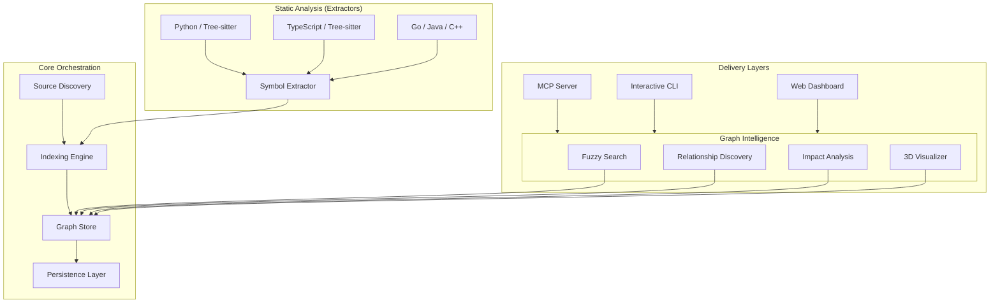

# Saurix Architecture

Saurix is built as a modular, domain-driven engine designed to transform static source code into a dynamic, queryable knowledge graph. This document provides a detailed breakdown of its internal systems.

## System Overview

The following diagram illustrates the high-level data flow and component relationships within Saurix:

---

## 1. Core Orchestration (`saurix.core`)

The core layer is responsible for the lifecycle of the knowledge graph.

- **Indexing Engine**: Coordinates the extraction process. It takes a project root, identifies relevant files using ignore-aware walkers, and passes them to the appropriate extractors.
- **Graph Store**: An in-memory property graph. It stores "Symbols" (functions, classes, variables) as nodes and "Relationships" (`CALLS`, `INHERITS`, `DEFINES`) as edges.
- **Persistence Layer**: Serializes the graph into a compressed JSON format (`saurix.graph.json`) for fast loading in subsequent sessions.

## 2. Static Analysis (`saurix.analysis`)

This layer performs the heavy lifting of understanding code without executing it.

- **Tree-sitter Integration**: Saurix uses Tree-sitter for high-performance, incremental parsing. This allows it to handle "broken" or partially written code gracefully.
- **Polyglot Extractors**: Language-specific logic identifies how symbols are defined and referenced. 
    - **Python**: Handles imports, function calls, class inheritance, and global variable usage.
    - **TypeScript/JavaScript**: Resolves module exports and complex call chains.
- **Relationship Resolution**: After initial extraction, a "linker" pass resolves string-based references (e.g., a function call) into direct edges between graph nodes.

## 3. Graph Intelligence (`saurix.discovery`)

Once the graph is built, this layer provides the intelligence used by agents and users.

- **Impact Analysis**: Calculates the "transitive closure" of a change. If you change a function, Saurix can tell you every file and function that might be affected, no matter how deep the dependency tree.
- **Shortest Path Discovery**: Finds how two seemingly unrelated symbols are connected (e.g., "How does the API endpoint eventually touch the Database model?").
- **Fuzzy Search**: A weighted search engine that prioritizes symbol relevance and architectural importance.

## 4. Model Context Protocol (`saurix.agents.mcp`)

This is the primary interface for AI agents (like Claude, Cursor, or ChatGPT).

- **Tooling Interface**: Exposes the graph intelligence as standard MCP tools.
- **Context Pruning**: Instead of sending thousands of lines of code to an LLM, Saurix sends only the relevant subgraph, drastically improving context window efficiency and reducing hallucination.

## 5. User Interfaces

- **CLI**: An interactive shell for developers to query their architecture directly from the terminal.
- **3D Visualizer**: A hybrid 2D/3D force-directed graph rendered in the browser (`saurix.html`), allowing users to fly through their codebase.

---

## Performance Goals

- **Zero-Config**: Works out of the box with `saurix init`.
- **Sub-Second Queries**: All relationship discovery and impact analysis tasks are optimized to return in milliseconds.
- **Incremental Indexing**: Only re-indexes files that have changed since the last run.
